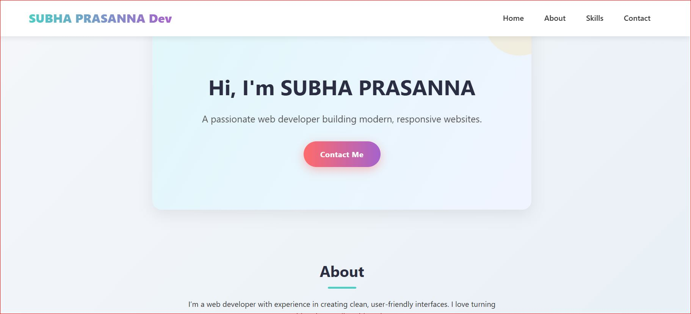
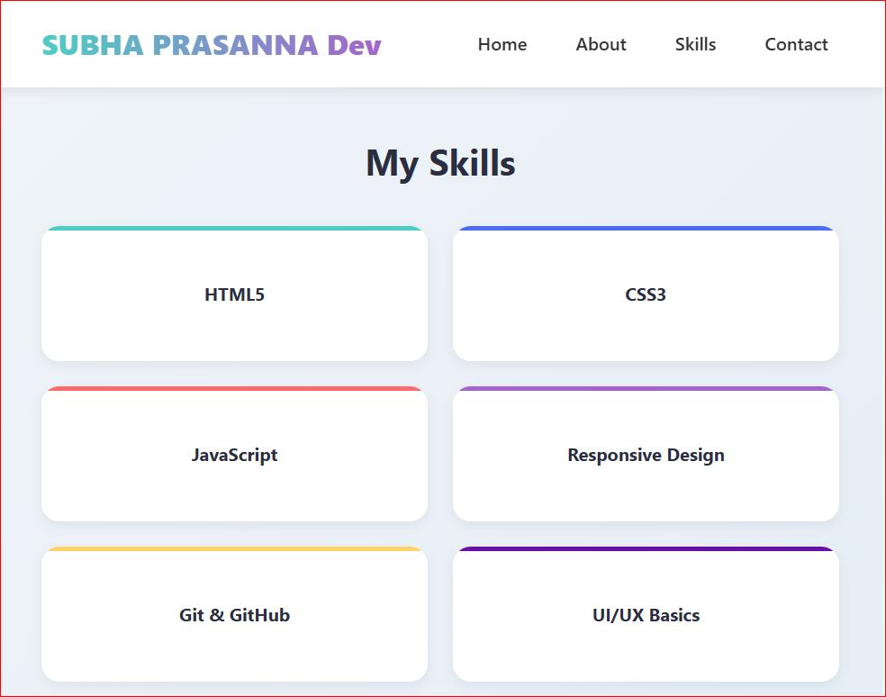

# Responsive Personal Portfolio (HTML + CSS Only)

A clean, responsive personal portfolio built with **vanilla HTML and CSS**—no frameworks.

## ✨ Features
- Fully responsive (Desktop, Tablet, Mobile)
- Mobile hamburger menu
- Skills grid with hover effects
- Subtle CSS animations
- Unique indigo-based color theme

## 🤖 AI Tool Used
- **v0.dev** (by Vercel)  
  Used to generate an initial responsive layout skeleton for the header, hero, and skills section.

## 🔧 Manual Improvements
- Added full mobile navigation with JavaScript toggle
- Implemented responsive grid for skills (3-col → 2-col → 1-col)
- Designed custom color theme (`#4a6cf7` as primary)
- Added smooth hover animations and fade-in effects
- Ensured no horizontal scrolling on all devices
- Integrated Font Awesome for social icons (CDN)
- Refined typography, spacing, and accessibility

## 📸 Screenshots

